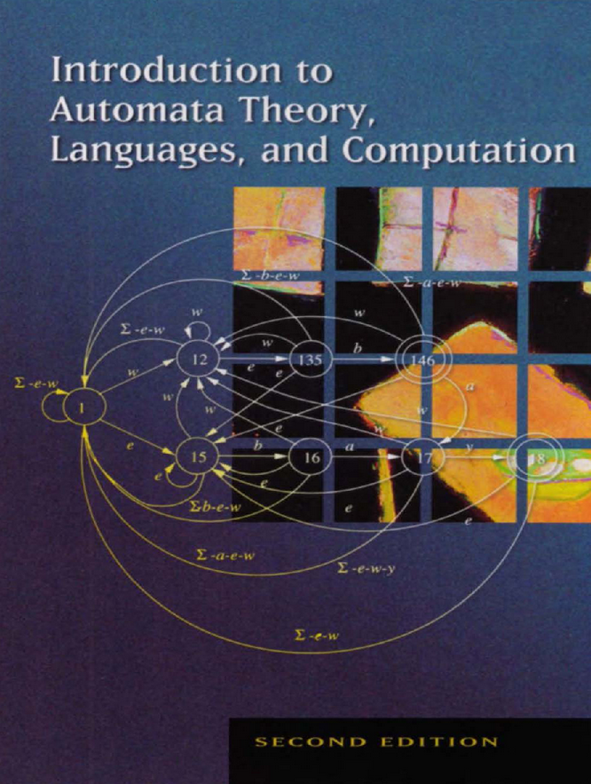

# &#1057;&#1086;&#1076;&#1077;&#1088;&#1078;&#1072;&#1085;&#1080;&#1077;

1.  [Что такое регулярные выражения?](#org10b7d18)
2.  [Варианты регулярок](#org81cc879)
3.  [Библиотеки RegEx в Python](#org0513ec0)
4.  [Глобы](#orgb758bca)
5.  [grep](#org2b2e302)
6.  [Наивная реализация регулярок](#org56eab2b)
7.  [Конечные Автоматы](#org2170ddc)
8.  [Поиск подстроки на DFA](#org3d8ea53)
9.  [Реализация RegExp на конечных автоматах](#org043e418)
10. [Примеры использования RE](#orgb0a8af3)
11. [Задача решена](#org56c6a6c)
12. [Задача решена?](#orgca9c281)
13. [Задача решена](#org0bc2e45)
14. [Опережающие и ретроспективные проверки](#orgb1d1994)
15. [Задача решена](#orgcd95cc1)
16. [Задача решена?](#orgab43db4)
17. [Задача решена!](#orgc472b29)
18. [lookahead & lookbehind](#orgf9b2f36)
19. [Жадные квантификаторы](#orgfb09ed5)
20. [Задача решена](#orgc9b36b7)
21. [Задача решена?](#org79e3fb9)
22. [Задача решена](#orgc68add8)
23. [Отладка RegExp](#org5028cf7)
24. [Практика](#org30fa69b)
25. [Практика](#org613aa60)
26. [Практика](#orgb37b64a)
27. [Практика](#orge68dedd)
28. [Литература](#org1c49624)

# Что такое регулярные выражения?

# Варианты регулярок

[PCRE](https://www.pcre.org/current/doc/html/pcre2syntax.html)

# Библиотеки RegEx в Python

-   [стандартная](https://docs.python.org/3/library/re.html)
-   [regex](https://github.com/mrabarnett/mrab-regex)

# Глобы

    man 7 glob

    import glob

    print(glob.glob("*.py"))

    ['automaton_kmp.py', 'naive_re.py', 'naive_grep.py']

# grep

*g/<Regular Expression>/p*

    echo "g/def/p" | ed naive_re.py

    1234
    def match(regexp: str, text: str) -> bool:
    def matchhere(regexp: str, text: str) -> bool:
    def matchstar(c: str, regexp: str, text: str) -> bool:

    ./naive_grep.py '^def .*(.*):$' \
      ../praktikum_project_5/*/*.py \
      | head -n 5

# Наивная реализация регулярок

    print(match("abc", "abc"))
    print(match("abc$", "xyzabc"))
    print(match("^abc", "xyzabc"))
    print(match("^abc", "abcx"))
    print(match("a*b", "bcd"))
    print(match("a*b", "aaaaabcd"))

    True
    True
    False
    True
    True
    True

# Конечные Автоматы

# Поиск подстроки на DFA

    kmp1 = KMP("abc")
    print(kmp1.search("abcd"))
    print(kmp1.search("fooabcd"))
    print(kmp1.search("foobar"))

    0
    3
    -1

# Реализация RegExp на конечных автоматах

[для особо пытливых](https://github.com/avli/nfa-regex)

# Примеры использования RE

    Задача: написать регулярку, проверяющую,
    что в строке корректный email адрес

# Задача решена

    print(re.search(
        r"\w+@\w+\.\w+",
        "example@gmail.com"
    )[0])
    print(re.search(
        r"\w[\w_.]+@\w+\.\w+",
        "example.1.2.3@gmail.com"
    )[0])

    example@gmail.com
    example.1.2.3@gmail.com

# Задача решена?

    print(re.search(
        r"\w+@\w+\.\w+",
        "example@foo.gmail.com"
    )[0])
    print(re.search(
        r"\w[\w_.]+@\w+\.\w+",
        "example.1.2.3@foo.gmail.com"
    )[0])

    example@foo.gmail
    example.1.2.3@foo.gmail

# Задача решена

    rg = re.compile(
      r"^[a-zA-Z0-9_.+-]+@[a-zA-Z0-9-]+"
      r"(?:\.[a-zA-Z0-9-]+)+$"
    )

    print(re.match(
        rg, "example@foo.gmail.com"
    )[0])
    print(re.match(
        rg, "example.1.2.3@foo.gmail.com"
    )[0])

    example@foo.gmail.com
    example.1.2.3@foo.gmail.com

# Опережающие и ретроспективные проверки

    Задача: заменить переводы строк на  ,
    за исключением случая, если перед этим шел html-тэг

# Задача решена

    import re

    print(re.sub(
        r"([^>])\n",
        r"\1<br\\>",
        "
Привет\nдрузья
"
    ))

    
Привет<br\>друзья

# Задача решена?

    import re

    print(re.sub(
        r"([^>])\n",
        r"\1<br\>",
        "
Привет\n\nдрузья
"
    ))

    
Привет<br\>
    друзья

# Задача решена!

    import re

    print(re.sub(
        r"(?<=[^>])\n",
        r"<br\>",
        "
Привет\n\nдрузья
"
    ))

    
Привет<br\><br\>друзья

# lookahead & lookbehind

-   **(?<=&#x2026;):** Должно совпасть слева (Позитивная ретроспективная проверка).
-   **(?<!&#x2026;):** Не должно совпасть слева (Негативная ретроспективная проверка).
-   **(?=&#x2026;):** Должно совпасть справа (Позитивная опережающая проверка).
-   **(?!&#x2026;):** Не должно совпасть справа (Негативная опережающая проверка).

# Жадные квантификаторы

    Задача: заменить буржуинские кавычки лапки
    на отечественные кавычки ёлочки.

# Задача решена

    print(re.sub(
        r'"(.+)"',
        r"«\1»",
        '"Идиот"'
    ))

    «Идиот»

# Задача решена?

    print(re.sub(
        r'"(.+)"',
        r"«\1»",
        '"Идиот" "Бесы"'
    ))

    «Идиот" "Бесы»

# Задача решена

    print(re.sub(
        r'"([^"]+)"',
        r"«\1»",
        '"Идиот" "Бесы"'
    ))
    print(re.sub(
        r'"(\w+)"',
        r"«\1»",
        '"Идиот" "Бесы"'
    ))

    «Идиот» «Бесы»
    «Идиот» «Бесы»

# Отладка RegExp

[RegeExer](https://regexr.com/)
[Как это отладить?!](http://www.ex-parrot.com/~pdw/Mail-RFC822-Address.html)

# Практика

    Задача: преобразовать все ссылки в тексте в
    html-тэги <a href=[url]>url</a>

# Практика

    Задача: является ли текст числом
    (в том числе, дробным)?

# Практика

    Задача: поставить пробелы после запятых,
    если их там нет.

# Практика

    Задача: заменить идущие подряд знаки ,.!? на один

# Литература

-   [import re](https://docs.python.org/3/library/re.html)
-   [lookahead & lookbehind](https://docs-python.ru/tutorial/ispolzovanie-reguljarnyh-vyrazhenij-python/operezhajuschaja-retrospektivnaja-proverka-pozitsii-regexp/)
-   [хорошая статья](https://habr.com/ru/post/349860/?ysclid=l15brkrx4y)
-   [Практика программирования](https://www.labirint.ru/books/518955/)
-   [Регулярные выражения](https://www.labirint.ru/books/647977/)
-   [NFA & RE](https://swtch.com/~rsc/regexp/regexp1.html)
-   [Алгоритмы](https://www.labirint.ru/books/512969/)
